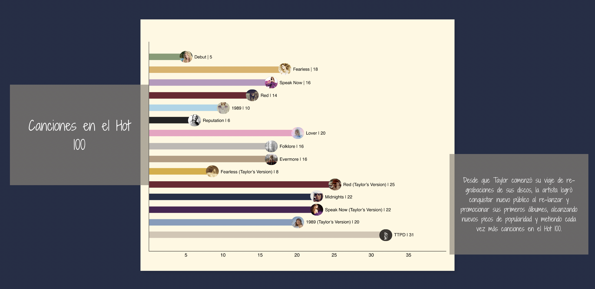

# VD | Svelte Scroller Entrega Final - Isabel y Estanislao

### Proyecto que implementa svelte-scroller para filtrar datos y mostrar visualizaciones de datos en una página web con efecto de scrollytelling.

### En nuestro proyecto se hace un recorrido numérico de la carrera de la cantante de Taylor Swift. En primer lugar se introducen datos de
### de su carrera para contextualizar al usuario de la magnitud de la misma. Luego se invita a scrollear para que comience el storytelling.
### En el mismo se hace una pasada por algunos de los hitos en la historia de Swift, mostrando los datos por álbum. Luego se dejan algunos
### datos curiosos sobre su gira mundial The Eras Tour. Finalmente, se implementan una serie de botones interactivos que le permiten al  ### usuario navegar álbum por álbum, profundizando la información de cada uno en una página web distinta.
---

### Referencias: 
- [https://github.com/sveltejs/svelte-scroller](https://github.com/sveltejs/svelte-scroller)
- [Escalas de d3.js](https://d3js.org/d3-scale)
- [Info Billboard](https://www.billboard.com/artist/taylor-swift/)
- [Metacritic](https://www.metacritic.com/music)
- [Info General](https://en.wikipedia.org/wiki/Taylor_Swift) 
[API de Intersection Observer](https://developer.mozilla.org/en-US/docs/Web/API/Intersection_Observer_API)

---